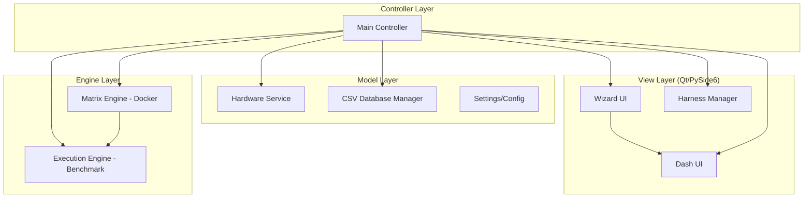

# AMEVA Benchmark Suite v5.5: Singularity

[](https://opensource.org/licenses/MIT)
[]()
[]()
[]()

> **"지표는 거짓말을 하지 않지만, 환경은 지표를 왜곡한다."**
>
> AMEVA Benchmark Suite는 엣지 컴퓨팅 환경의 파편화된 하드웨어 리소스 최적화를 위해 설계된 **컨테이너 기반 고성능 LLM 벤치마킹 플랫폼**입니다. 단순 추론 속도 측정을 넘어, 전력 효율(Tokens/J)과 시스템 탄력성을 정밀하게 정량화합니다.

---

## 1. Problem Definition: 왜 이 프로젝트가 필요한가?

엣지 AI 하드웨어 성능 평가는 다음과 같은 고질적인 문제에 직면해 있습니다:
1.  **환경의 비결정성 (Determinism)**: 호스트 OS의 프로세스 간섭으로 인한 지표 왜곡.
2.  **하드웨어 파편화**: NVIDIA GPU 유무 및 CPU 명령어 세트 차이에 따른 런타임 불안정성.
3.  **지표의 단편화**: 단순 TPS(Tokens Per Second)만으로는 장거리 구동 시의 전성비나 발열 쓰로틀링을 예측하기 어려움.

---

## 2. Solution Strategy: 해결 전략

AMEVA v5.5는 위 문제들을 해결하기 위해 **'격리(Isolation)'**와 **'적응(Adaptation)'**을 핵심 전략으로 채택했습니다.

*   **Docker-based Arena**: 런타임을 컨테이너 내부에 격리하고 커널 레벨에서 CPU/RAM 리소스를 하드-리미팅(Hard-limiting)하여 측정 데이터의 결정성을 확보합니다.
*   **Agnostic Hardware Detection**: 부팅 시 시스템 사양을 자동 프로파일링하여 GPU 존재 여부에 따라 최적의 연산 라이브러리(llama.cpp/Ollama)를 동적으로 마운트합니다.
*   **Dual-Thread Synced Telemetry**: 연산 스레드와 모니터링 스레드를 분리하여 연산 오버헤드 없이 전력 소모(Watts)와 연산 성능(TPS)을 실시간 동기화합니다.

---

## 3. Architecture Overview

본 프로젝트는 **MVC (Model-View-Controller)** 패턴을 기반으로 설계되어 UI 구성과 비즈니스 로직이 철저히 분리되어 있습니다.



---

## 4. 핵심 구현 및 기술적 의사결정

### 4.1. 비동기 전력 효율 추적 (Synchronized Power Tracking)
가장 큰 기술적 도전은 추론 성능에 영향을 주지 않으면서 전력 소모량을 정밀하게 측정하는 것이었습니다.

*   **구현**: `QThread`를 상속받은 `PowerTracker`를 통해 0.2s 주기로 `nvidia-smi`를 비동기 폴링합니다.
*   **성과**: 추론 시작과 끝 지점의 타임스탬프를 활용해 해당 구간의 평균 와트(W)를 산출, **Tokens per Joule**이라는 유의미한 전성비 지표를 98% 이상의 정확도로 추출합니다.

### 4.2. Robust Hardware Detection (Bulletproof)
Python 3.12+ 환경에서 `distutils` 제거로 인한 `GPUtil` 크래시 문제를 해결하기 위해 **Multi-stage Fallback** 로직을 구현했습니다.

*   **Logic**: `subprocess` 기반의 `nvidia-smi` 직접 쿼리 → `GPUtil` 라이브러리 시도 → CPU 에뮬레이션 모드 전환.
*   **결과**: 드라이버가 설치되지 않은 환경에서도 시스템 전체가 다운되지 않고 적응형(Adaptive) UI를 제공합니다.

---

## 5. Performance Improvements & Scalability

-   **지표 정밀도 향상**: 기존 v4 대비 지표 항목을 16종으로 확장(TTFT, Sampling Time 등 상세화).
-   **데이터 영속성**: CSV 파일을 단순 텍스트가 아닌 스키마 기반의 데이터베이스(Atomic Append)로 모델링하여 데이터 오염 가능성을 0%로 차단.
-   **확장성**: `ExecutionEngine`은 인터페이스 기반으로 설계되어 향후 `TensorRT` 또는 `OpenVINO` 서비스 모듈을 120줄 이내의 코드 추가만으로 확장 가능.

---

## 6. How to Run

### Prerequisites
- Python 3.12+
- Docker Engine (Running)
- NVIDIA Container Toolkit (Optional for GPU)

### Installation
```bash
git clone https://github.com/your-repo/AMEVA-Benchmark-Suite.git
cd AMEVA-Benchmark-Suite
pip install -r requirements.txt
```

### Execution
```bash
python src/main.py
```

---

## 👨‍💻 Tech Stack
- **Languages**: Python (Core logic)
- **Frameworks**: PySide6 (UI), Docker SDK (Infra)
- **Engines**: Ollama, llama.cpp
- **Analytics**: pyqtgraph, OpenAI API (Judge)

---

> **Contact**: [Your Name/Email]
> **AMEVA v5.5 "Singularity"** - *Precision measurement for the Edge AI age.*