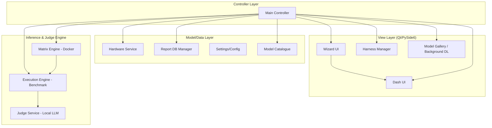

# AMEVA Benchmark Suite v5.6: Singularity

[](https://opensource.org/licenses/MIT)
[]()
[]()
[]()
[]()

> **"지표는 거짓말을 하지 않지만, 환경은 지표를 왜곡한다."**
>
> AMEVA Benchmark Suite는 엣지 컴퓨팅 환경의 파편화된 하드웨어 리소스 최적화를 위해 설계된 **컨테이너 기반 고성능 LLM 벤치마킹 플랫폼**입니다. 단순 추론 속도 측정을 넘어, 전력 효율(Tokens/J)과 지능 지표(GSM8K, KMMLU 등)를 정밀하게 정량화합니다.

---

## 1. Problem Definition: 왜 이 프로젝트가 필요한가?

엣지 AI 하드웨어 성능 평가는 다음과 같은 고질적인 문제에 직면해 있습니다:
1.  **환경의 비결정성 (Determinism)**: 호스트 OS의 프로세스 간섭으로 인한 지표 왜곡.
2.  **하드웨어 파편화**: NVIDIA GPU 유무 및 CPU 명령어 세트 차이에 따른 런타임 불안정성.
3.  **지표의 단편화**: 단순 TPS(Tokens Per Second)만으로는 장거리 구동 시의 전성비나 실제 '지능'의 정밀도를 측정하기 어려움.

---

## 2. Solution Strategy: v5.6의 해결 전략

AMEVA v5.6은 **'격리(Isolation)'**, **'적응(Adaptation)'**, 그리고 **'지능화(Intelligence)'**를 핵심 전략으로 채택했습니다.

*   **Docker-based Arena**: 런타임을 컨테이너 내부에 격리하고 리소스를 하드-리미팅하여 측정 데이터의 결정성을 확보합니다.
*   **Smart SWAP Kernel**: 모델 변경 시 엔진을 수동으로 재시작할 필요 없이, 추론 직전 도커 컨테이너를 자동으로 리부팅하여 최적의 마운트 상태를 유지합니다.
*   **Academic Grade Harness**: GSM8K, MATH, HumanEval 등 글로벌 표준 지표 카테고리를 하네스에 도입하여 모델의 '분야별 지능' 성적표를 산출합니다.
*   **AI-Judge Rationale**: 단순 수치화된 점수뿐만 아니라, EXAONE 3.5 기반의 판정관이 내린 상세한 '이유(Rationale)'를 CSV 리포트에 영구 기록합니다.

---

## 3. Architecture Overview

본 프로젝트는 **MVC (Model-View-Controller)** 패턴을 기반으로 설계되어 UI 구성과 비즈니스 로직이 철저히 분리되어 있습니다.



---

## 4. 핵심 구현 및 기술적 의사결정 (Technical Trade-offs)

### 4.1. 비동기 백그라운드 다운로드 매니저 (Persistent Worker Strategy)
사용자가 모델 갤러리 창을 닫아도 다운로드가 중단되지 않게 만드는 과정에서 큰 트레이드오프가 있었습니다.

*   **Trade-off**: `Dialog` 수명 주기에 귀속된 워커 vs `Main` 컨트롤러에 귀속된 중앙 관리형 워커.
*   **Decision**: 중앙 관리형 워커(`_dl_workers`)를 채택했습니다. 다이얼로그 폐쇄 시 발생하는 `QThread` 파괴 문제를 해결하기 위해 **5초 지연 삭제(Delayed Cleanup)** 로직을 구현하여 모든 시그널이 안전하게 상태바에 도달하도록 보장했습니다. 이를 통해 UI 차단 없는 쾌적한 UX를 확보했습니다.

### 4.2. Smart SWAP vs Soft Model Loading
사용자가 대시보드에서 모델을 변경할 때, 엔진 내부에서 모델만 갈아끼울 것인지 컨테이너를 재시작할 것인지의 선택이었습니다.

*   **Trade-off**: 런타임 모델 로딩(빠름) vs 컨테이너 재시작(안정적/클린 스테이트).
*   **Decision**: **컨테이너 재시작(Smart SWAP)**을 선택했습니다. 엣지 환경에서는 이전 추론 잔여 데이터가 VRAM/RAM에 남을 경우 지표 왜곡이 심각합니다. 1~2초의 부팅 지연을 감수하더라도, 매 테스트마다 커널 전역 상태를 초기화하여 **100% 재현 가능한 지표**를 얻는 데 우선순위를 두었습니다.

### 4.3. Resource Management for AI Judging
벤치마크 대상 모델과 판정관(Judge) 모델이 동시에 돌아갈 때 발생하는 OOM(Out of Memory) 문제를 해결해야 했습니다.

*   **Trade-off**: 동시 실행(채점 속도 빠름) vs 순차 실행(낮은 사양에서도 안정적).
*   **Decision**: 벤치마크 엔진이 종료된 직후 **Resources Unloading(명시적 반납)** 과정을 거쳐 판정관 모델을 로드하는 순차형 파이프라인을 구축했습니다. 덕분에 16GB 이하 RAM 환경에서도 8B급 모델 간의 상호 교차 평가가 가능해졌습니다.

---

## 5. Performance Metrics (Academic Standards)

v5.6 "Singularity"는 이제 글로벌 리더보드 수준의 지표를 산출합니다:
-   **GSM8K / MATH**: 초등/중등 수학 및 논리 추론 분석.
-   **HumanEval / MBPP**: 파이썬 코딩 능력 및 알고리즘 효율성 측정.
-   **KMMLU**: 한국적 문화 맥락 및 전문 지식 이해도 평가.
-   **TTFT (Time To First Token)**: 첫 토큰 응답 속도 정밀 트래킹.
-   **Tokens per Joule**: 전력 소모 대비 연산 효율(전성비) 자동 산출.

---

## 6. How to Run

### Prerequisites
- Python 3.12+ (Virtual Environment Recommended)
- Docker Desktop (Running)
- Ollama Engine (Optional but Recommended for Judging)

### Installation
```bash
git clone https://github.com/your-repo/AMEVA-Benchmark-Suite.git
cd AMEVA-Benchmark-Suite
python -m venv venv
source venv/bin/activate  # Windows: venv\\Scripts\\activate
pip install -r requirements.txt
```

### Execution
```bash
python src/main.py
```

---

## 👨💻 Tech Stack
- **UI Architecture**: PySide6 (Modern MVC)
- **Infrastructure**: Docker SDK (Hard Resource Isolation)
- **Inference**: Ollama API, llama.cpp (Dockerized Server)
- **Judge Core**: LG EXAONE 3.5 (State-of-the-Art Korean LLM)
- **Backend**: CSV Atomic Append (Immutable Log System)

---

> **Contact**: [Your Name/Email]
> **AMEVA v5.6 "Singularity"** - *Precision measurement for the Edge AI age.*