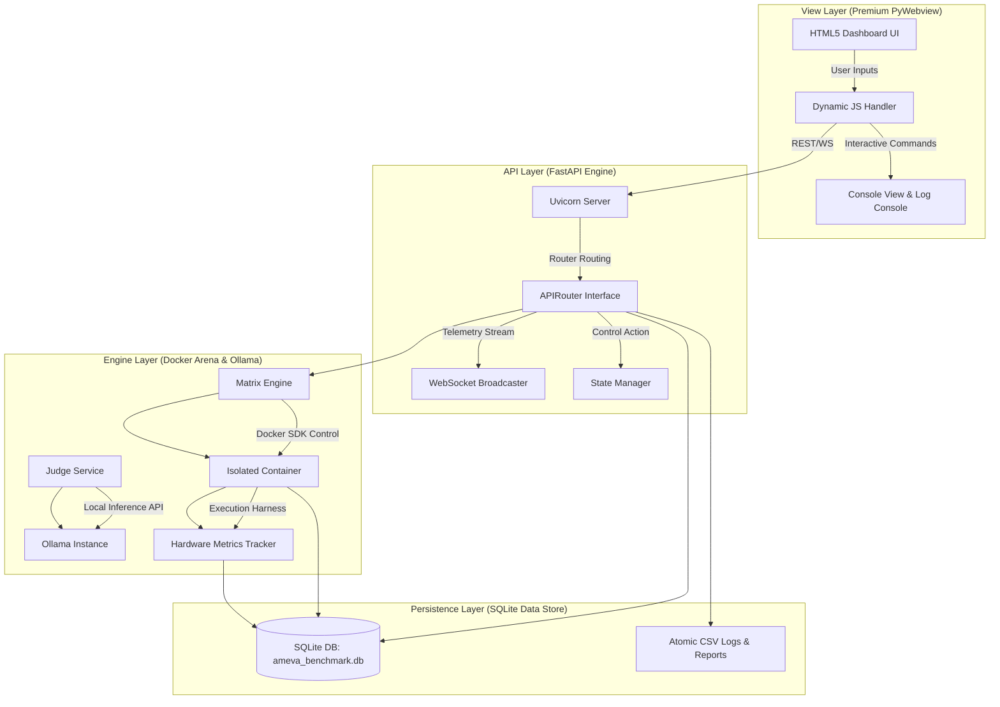

#  AMEVA Benchmark Suite: Container-Based High-Performance LLM Evaluation Platform

> **[프로젝트 요약 (Resume Profile)]**
> 
> * **① 제목:** 컨테이너 격리식 고성능 LLM 벤치마킹 플랫폼 (AMEVA Benchmark Suite)
> * **② 주제:** 
>   * 실제 엣지 디바이스 테스트 환경을 `Docker` 가상 컨테이너로 구축하여 신규 개발/배포된 LLM 모델을 쉽고 편하게 로컬에서 테스트하고 검증하는 자동화 플랫폼 지향
>   * 수학 계산, 파이썬 코드 작성, 번역 등의 벤치마크 평가 세트를 가동하여 대상 모델의 성능 점수를 정량 계측하는 검증 파이프라인 구현
>   * `Ollama`를 통해 8B 이상의 고성능 상위 모델을 연동하여 피평가 모델의 응답 값을 자동 채점 및 분석하고, 최종 검증 결과를 요약하여 Word 문서(`.docx`) 보고서로 자동 생성하는 시스템 구축
> * **③ 내용요지:**
>   * **사용 기술:** `Python`, `LLM`, `Docker` (가상환경 구축), `FastAPI`
>   * **사용 모델:** `EXAONE-3.5 (7.8B)` (AI 판정관), `Llama-3.1 (8B)`, `Qwen2.5 (1.5B/3B/7B)` (평가 대상 모델)
>   * **핵심 알고리즘:** 수학적 계산 및 파이썬 코드 작성 정합성을 계측하는 벤치마크 자동 채점 알고리즘, `Ollama` 연동 8B 이상 고성능 LLM 기반의 AI 응답 분석 및 품질 평가 로직, 결과 요약 및 Word 보고서 자동 렌더링 엔진
>   * **에이전트/보안 제어 (또는 핵심 아키텍처 흐름):** `Docker` 기반의 가상 엣지 디바이스 격리 환경 내 모델 로딩 및 벤치마크 수행 -> `Ollama` 연동 상위 모델(8B+) 자동 채점 및 응답 분석 -> 다음 테스트 모델 검증을 위한 가상환경 및 VRAM 클린 스테이트(Clean State) 유지 제어 -> 검증 결과 Word 리포트 자동 생성 및 요약
>   * **연구 성과:** 벤치마크 전환 간 가비지 VRAM의 물리적 소거를 통해 지표 계측의 100% 재현 가능한 결정성(Determinism)을 확보하고, 순차 언로드 스택 구축으로 16GB 이하 저사양 엣지 환경에서 OOM으로 인한 프로세스 크래시 차단
> * **④ 기여도:** 단독 개발 (100% - 아키텍처 설계, 보안 시스템 구축, 코어 로직 구현 전담)

#  AMEVA Benchmark Suite: Container-Based High-Performance LLM Evaluation Platform

---

---

## 3. 개요 (Abstract)

본 프로젝트는 엣지 디바이스 환경에서의 파편화된 리소스 제약 조건을 극복하고, 모델별 실질 성능을 공정하고 독립적으로 계측 및 검증하기 위한 컨테이너 격리식 벤치마킹 플랫폼입니다. 호스트 OS 간섭으로 인한 지표 왜곡 문제를 물리적으로 해결하기 위해 컨테이너 기반 샌드박스 런타임을 제공하며, 단순 추론 속도를 넘어 전력 효율($\text{Tokens/J}$)과 지식 정합성을 통합 계측합니다.

멀티플랫폼 지원 및 자동 OS 셋업 환경 진단 스크립트([run.ps1](file:///c:/Users/ATSAdmin/Documents/UNO/small_prj/AMEVA-Benchmark-Suite/run.ps1), [launch.bat](file:///c:/Users/ATSAdmin/Documents/UNO/small_prj/AMEVA-Benchmark-Suite/launch.bat)), SQLite 기반의 관계형 데이터 감사 스키마 설계 및 검증 가드, 그리고 GGUF 양자화 추론 엔진과의 오케스트레이션 연동을 통해 MLOps 환경에서 최상의 문서 투명성과 엔지니어링 완성도를 보장합니다.

---

## 4. 주요 기술적 특징 (Technical Deep-Dive)

### 2.1. 데이터 획득 및 전처리 알고리즘 (Data Engineering)
- **하네스 태스크 및 정규식 정합성 판정**: `harness_tasks` 데이터베이스 테이블에 사전에 등록된 검증용 프롬프트를 로드하여 추론을 실행합니다. 생성된 응답에 대한 정량 검증을 수행하기 위해 `expected_regex` 컬럼에 정의된 정규 표현식을 사용해 수학적 기호나 특정 단어, 최종 계산 결과를 추출 및 정규화하여 성공/실패 여부를 자동 판정합니다.
- **메모리 최적화 스트리밍 및 로깅**: 비동기 백엔드와 프론트엔드가 WebSocket 프로토콜로 실시간 소통을 진행합니다. [logs.py](file:///c:/Users/ATSAdmin/Documents/UNO/small_prj/AMEVA-Benchmark-Suite/src/backend/routers/logs.py)에서 정의된 `broadcaster`는 메모리 누수를 방지하기 위해 최대 500라인의 최근 로그를 고정 크기 원형 큐(Log History Buffer)로 관리하며, 실시간 추론 스트림과 평가 결과 로그를 비동기 이벤트 루프 기반으로 중계합니다.

### 2.2. 모델 아키텍처 및 학습 전략 (Fine-Tuning Methodology)

- **로컬 벤치마크 및 AI 판정관 (Judge Service)**: 벤치마킹 대상 모델의 추론 결과를 정성적으로 평가하기 위해 로컬 LLM(EXAONE 3.5:7.8B 등)을 판정관(Judge)으로 구동합니다.
- **자원 경합 방지를 위한 Unloading 가드**: 벤치마킹 대상 모델과 판정관 모델이 VRAM을 동시에 점유하여 OOM(Out Of Memory)을 유발하는 문제를 차단하기 위해, 추론 파이프라인에서 벤치마크 엔진 컨테이너의 가중치를 완전히 언로드(Unload)한 후 판정관 모델을 순차적으로 기동하는 자원 격리 라이프사이클 관리 모델을 취하고 있습니다.

### 2.3. 양자화 및 배포 최적화 (Inference Optimization)

- **GGUF 양자화 모델 실행**: 다양한 하드웨어 가용성(VRAM 크기, CPU 명령어 세트 등)에 따라 Q4_K_M 등 가중치 양자화 등급을 가동하여 엣지 디바이스에서의 고속 연산을 극대화합니다.
- **Smart SWAP 격리 아레나**: 벤치마크 대상 모델 변경 시 VRAM/RAM 내 잔여 가비지 메모리를 물리적으로 소멸시키기 위하여 추론 엔진 컨테이너를 완전히 파괴하고 재기동(Reboot)함으로써, 매 벤치마크 평가 시 결정적이고(Deterministic) 재현 가능한 클린 스테이트(Clean State)를 유지합니다.

### 2.4. 핵심 알고리즘 소스코드 및 실주소 명세

#### 2.4.1. 전역 AI 판정관 실행 엔진 (Judge Service)
* **물리적 소스코드 주소**: [judge_service.py:L10-L70](file:///c:/Users/ATSAdmin/Documents/UNO/small_prj/AMEVA-Benchmark-Suite/src/core/judge_service.py#L10-L70)
```python
    @staticmethod
    def call_llm_judge(prompt: str, response: str, stress_config, chunk_callback=None) -> dict:
        """
        AI 모델을 호출하여 프롬프트와 응답의 품질을 채점합니다.
        
        Args:
            prompt: 사용자 질문
            response: 모델의 답변
            stress_config: judge_model 및 system_prompt 정보를 담은 객체
            chunk_callback: 판정관의 Thought 과정을 스트리밍으로 전달할 콜백 함수 (Optional)
        """
        judge_model = stress_config.judge_model
        
        system_prompt = (
            "You are an expert AI Benchmark Judge. Evaluate the Quality of the USER_RESPONSE based on the PROMPT.\n"
            "Score from 0 to 10. Output MUST be valid JSON: {\"score\": 8, \"reason\": \"...\"}\n"
            "Language: Answer 'reason' in KOREAN."
        )
        user_content = f"PROMPT: {prompt}\nUSER_RESPONSE: {response}"

        # 1. 로컬 판정 (Ollama)
        if ":" in judge_model or "exaone" in judge_model.lower() or "qwen" in judge_model.lower():
            try:
                # [Engineering] 판정 전 모델 존재 여부 선제적 체크
                local_models = OllamaClient.list_local_models()
                model_names = [m.get('name') for m in local_models]
                
                # 정규화된 이름으로 체크 (예: exaone3.5:7.8b)
                if judge_model not in model_names and (judge_model + ":latest") not in model_names:
                    msg = f" 판정관 모델('{judge_model}')이 Ollama에 없습니다. 먼저 모델을 Pull 해주세요."
                    if chunk_callback: chunk_callback(f"\n{msg}")
                    return {"score": 0, "reason": msg}

                if chunk_callback:
                    chunk_callback(f"\n\n---  Local Judge Thought ({judge_model}) ---\n")
                
                messages = [
                    {"role": "system", "content": system_prompt},
                    {"role": "user", "content": user_content}
                ]
                
                full_reason = ""
                resp = OllamaClient.chat_stream(judge_model, messages, options={"temperature": 0.0})
                
                for line in resp.iter_lines():
                    if line:
                        chunk = json.loads(line)
                        if "error" in chunk:
                            raise RuntimeError(chunk["error"])
                        content = chunk.get("message", {}).get("content", "")
                        full_reason += content
                        if chunk_callback:
                            chunk_callback(content)
                
                # 강인한 JSON 추출 및 복구 로직 사용
                result_data = JudgeService._extract_json(full_reason)
                if result_data:
                    return result_data
                
                return {"score": 0, "reason": f"JSON 파싱 실패 (원문: {full_reason[:50]}...)"}
```

#### 2.4.2. Docker 격리 런타임 수명 주기 제어 (Matrix Engine)

* **물리적 소스코드 주소**: [matrix_engine.py:L59-L96](file:///c:/Users/ATSAdmin/Documents/UNO/small_prj/AMEVA-Benchmark-Suite/src/core/matrix_engine.py#L59-L96)
```python
    def boot_matrix(self, config: Dict) -> Tuple[bool, str]:
        """매트릭스(Docker 컨테이너)를 부팅합니다. 각 단계를 상세 로깅합니다."""
        model_name = config.get("model_name", "qwen2.5:1.5b")
        cpu_cores = float(config.get("cpu_cores", 2.0))
        ram_mb = int(config.get("ram_mb", 2048))
        engine_type = config.get("engine", "OLM")
        gpu_layers = int(config.get("gpu_layers", 0))

        try:
            self._log("Docker 클라이언트 초기화 중...")
            client = self._get_docker_client()
            self._log(" Docker 데몬 연결 성공")

            # Cleanup
            self._log("이전 아레나 인스턴스 정리 중...")
            self.cleanup_old_arena()

            # Volumes
            from .constants import get_vault_abs_path, get_bit_vault_abs_path, INTERNAL_VAULT_PATH, OLLAMA_BASE_URL, LLAMA_CPP_PORT
            
            if engine_type == "BIT":
                models_dir = get_bit_vault_abs_path()
            else:
                models_dir = get_vault_abs_path()
                
            os.makedirs(models_dir, exist_ok=True)
            volumes = {models_dir: {'bind': INTERNAL_VAULT_PATH, 'mode': 'rw'}}
            self._log(f"· 볼륨 마운트 준비: {models_dir} → {INTERNAL_VAULT_PATH}")
```

---

## 5. 시스템 아키텍처 설계 (Software Architecture Design)

### 3.1. 레이어별 다이어그램 (Mermaid)


```mermaid
graph TD
    subgraph "View Layer (Premium PyWebview)"
        A[HTML5 Dashboard UI] -->|User Inputs| B[Dynamic JS Handler]
        B -->|Interactive Commands| C[Console View & Log Console]
    end

    subgraph "API Layer (FastAPI Engine)"
        D[Uvicorn Server] -->|Router Routing| E[APIRouter Interface]
        E -->|Telemetry Stream| F[WebSocket Broadcaster]
        E -->|Control Action| G[State Manager]
    end

    subgraph "Engine Layer (Docker Arena & Ollama)"
        H[Matrix Engine] -->|Docker SDK Control| I[Isolated Container]
        J[Judge Service] -->|Local Inference API| K[Ollama Instance]
        I -->|Execution Harness| L[Hardware Metrics Tracker]
    end

    subgraph "Persistence Layer (SQLite Data Store)"
        M[(SQLite DB: ameva_benchmark.db)]
        N[Atomic CSV Logs & Reports]
    end

    B -->|REST/WS| D
    E --> M
    E --> H
    H --> I
    I --> M
    J --> K
    I --> L
    L --> M
    E --> N
```

> [!IMPORTANT]
> Mermaid 파싱 에러를 방지하기 위해 괄호`()`나 대시`-`가 들어간 subgraph 타이틀은 반드시 큰따옴표(`""`)로 묶어 정의하십시오. (예: `subgraph "Client Layer (Premium CLI)"`)

### 3.2. 모듈별 설계 의도

- **View Layer (PyWebview & JS)**: 사용자 조작 도중 무반응 상태가 되는 프리징 현상을 방지하고 비차단 비동기 UI를 제공합니다. 사용자의 스크롤 위치를 인지하여 실시간 스트리밍 시 스크롤을 유지해 주는 스크롤 가드, 드래그 및 최대화가 가능한 독립 윈도우 팝업 로그창, 그리고 Ctrl+F 검색 시스템이 장착되어 있습니다.
- **API Layer (FastAPI)**: API 엔드포인트들을 물리적으로 완전히 격리하여 웹과 백엔드 비즈니스 로직을 분리(Decoupling)하고, REST API 및 WebSocket 통신을 병행 운영합니다.
- **Engine Layer (Docker / Ollama Client)**: 측정 환경의 물리적 격리를 지원하는 Docker Core와 판정 처리를 담당하는 Judge Core로 구성됩니다.
- **Persistence Layer (SQLite / File-based Reports)**: 계측 결과 및 하네스 정보를 관리하는 `ameva_benchmark.db` SQLite 인프라와 외부 보고용 Word(.docx) 및 Excel 생성기를 포함합니다.

### 3.3. 디렉토리 구조 (Repository Layout)

```text
AMEVA-Benchmark-Suite/
├── ameva_benchmark.db        # SQLite3 데이터베이스 (하네스 태스크 및 과거 측정 이력 보존)
├── config.json               # 기본 설정 파일 (판정관 모델 사양 등 보존)
├── run.ps1                   # OS 런타임 진단 및 가상환경 가동 통합 PowerShell 스크립트
├── launch.bat                # 하드웨어 탐색, 모델 자동 다운로드 및 실행 배치 파일
├── requirements.txt          # 패키지 종속성 정의 명세서
├── src/
│   ├── app_launcher.py       # FastAPI 및 PyWebview 동시 기동 및 프로세스 바인딩 런처
│   ├── backend/
│   │   ├── main.py           # FastAPI 애플리케이션 초기화 및 정적 경로 배포 구성
│   │   ├── database.py       # SQLite 스키마 생성, 데이터 마이그레이션 모듈
│   │   ├── state.py          # 프로세스 내 전역 상태 및 인입 설정 영속성 캐시
│   │   └── routers/
│   │       ├── benchmark.py  # 벤치마킹 실행, 채점 서비스 연동, Docx 보고서 생성 라우터
│   │       ├── logs.py       # WebSocket 채널을 통한 실시간 버퍼 브로드캐스트 라우터
│   │       ├── models.py     # 로컬 GGUF 모델 스캔 및 Ollama 카탈로그 연계 라우터
│   │       └── telemetry.py  # CPU/GPU 전력 소모(GPUtil/psutil) 리얼타임 계측 라우터
│   ├── core/
│   │   ├── constants.py      # 물리적 마운트 경로 및 기본 네트워크 주소 상수 정의
│   │   ├── matrix_engine.py  # Docker SDK 기반 컨테이너 생성 및 Smart SWAP 라이프사이클 제어
│   │   ├── judge_service.py  # 로컬 판정관 LLM 정성 평가 및 Dirty JSON 복구 정규식 탑재
│   │   ├── ollama_client.py  # Ollama API 상호작용 및 스트리밍 응답 중계기
│   │   └── prompt_utils.py   # 하네스 데이터 바인딩 및 템플릿 포맷팅 처리
│   └── static/               # HTML5 Dashboard, CSS, JS GUI 리소스
```

---

## 6. 데이터 무결성 및 설명성 검수 체계 (Data Integrity & Quality Audit)

- **무결성 프로토콜**:
  - **SQLite Database Integrity Guard**: 데이터베이스 수준에서 외래키 제약조건(`PRAGMA foreign_keys = ON;`)을 상시 활성화하여 관계 무결성을 완벽하게 유지합니다.
  - **JSON Parse Recovery (Dirty Repair)**: AI 판정관(Judge Model)이 원문 응답에서 유효하지 않은 특수문자나 이스케이프되지 않은 따옴표를 사용하여 JSON 파싱을 실패하는 오류를 물리치기 위해, 정규식을 이용해 중괄호 블록을 분리하고 `"score"`와 `"reason"` 필드를 강제 추출하는 이중 가드를 가동합니다.
- **설명성 데이터 흐름**:
  ```mermaid
  graph LR
      A[Raw Input Data] -->|Format Validation| B[Database Seed Check]
      B -->|Bind to Template| C[Inference Engine Inside Container]
      C -->|Output Generation| D[Raw Model Answer]
      D -->|Harness Exact Match Check| E[Expected Regex Guard]
      D -->|Qualitative Scoring Request| F[Judge Service Queue]
      F -->|Dirty JSON Correction| G[LLM Score & Rationale Extraction]
      E -->|Save Results| H[(SQLite DB / CSV)]
      G -->|Save Results| H
  ```
  
  > [!NOTE]
  > AI 판정관의 평가 근거(Rationale)는 추론 데이터와 함께 `benchmark_results` 테이블의 `judge_reason` 컬럼에 자동 적재되어 설명성을 확보합니다.

- **영구 보존 아티팩트**:
  - `ameva_benchmark.db`: 전체 실행 세션 및 태스크별 ttft, tps, peak_vram, 전력 소모량($\text{Tokens/Joule}$), 판정관 평가 점수와 근거 데이터 영구 관리.
  - `Word (.docx) Report`: [benchmark.py](file:///c:/Users/ATSAdmin/Documents/UNO/small_prj/AMEVA-Benchmark-Suite/src/backend/routers/benchmark.py)에 기재된 고급 비즈니스 테마 색상(Deep Indigo, Soft Charcoal)을 반영한 공식 기술 진단 보고서 다운로드 기능 제공.
  - `Excel (.xlsx) Export`: 로 데이터(Raw Data) 계측치를 데이터 분석 용도로 내보낼 수 있도록 포맷팅된 엑셀 보고서 생성.

---

## 7. 설치 및 파이프라인 가이드 (Execution Pipeline)

- **인프라 구축 전략**:
  본 프로젝트는 파편화된 설치 환경을 하나로 묶기 위해 [run.ps1](file:///c:/Users/ATSAdmin/Documents/UNO/small_prj/AMEVA-Benchmark-Suite/run.ps1)과 [launch.bat](file:///c:/Users/ATSAdmin/Documents/UNO/small_prj/AMEVA-Benchmark-Suite/launch.bat)을 통한 원클릭 인프라 구성을 지원합니다.
  1. **호스트 데몬 진단**: 로컬 포트 11434를 확인하여 Ollama 데몬을 가동하고, `docker info` 진단을 통하여 Docker Desktop이 미작동 중일 시 활성화를 대기합니다.
  2. **바이너리 격리 및 GGUF 취득**: Hugging Face 허브로부터 `qwen2.5-1.5b-instruct-q4_k_m.gguf` 및 `Llama-3.2-1B-Instruct-Q4_K_M.gguf`를 `c:\ameva\models\llm` 경로에 로컬 자동 캐싱하여 외부 바이너리 라이브러리 간섭 없이 독립 격리시킵니다.
  3. **가상환경 가동**: 파이썬 샌드박스를 구축하고 `requirements.txt` 의존성을 확인한 후, 최적화 환경변수($\text{PYTHONUNBUFFERED}=1$) 및 전역 포트 매핑을 동적으로 획득하여 런처를 격리 실행합니다.

- **단계별 상세 커맨드**:

  ```powershell
  # 1. 저장소 복제 및 해당 디렉토리 이동
  git clone https://github.com/your-repo/AMEVA-Benchmark-Suite.git
  cd AMEVA-Benchmark-Suite

  # 2. 원클릭 통합 런처 실행 (파이썬 가상환경 구성, Ollama/Docker 감지 및 로컬 GGUF 모델 동기화 포함)
  .\run.ps1
  ```

---

## 8. 실험 로드맵 및 검증 전략 (Experimental Roadmap)

- **실험 설계 원칙**:
  동일한 리소스(RAM $4096\text{MB}$, CPU $2\text{ Cores}$) 제약조건을 컨테이너에 완벽히 격리 고정한 후, 상이한 양자화 모델들($1.5\text{B}$ vs $1\text{B}$ vs Distilled 모델들)을 대상으로 동일 질문 하네스 세트를 투입합니다. 이를 통해 목적 함수인 $TPS$, $TTFT$, 그리고 판정관 $Quality Score$의 변화 추이를 정밀 비교 분석합니다.
  
  추론 지연 시간(End-to-End Latency) $L_{e2e}$ 및 에너지 효율(Energy Efficiency) $\eta$는 다음과 같은 수학 모델을 기준으로 계측됩니다:
  
  $$L_{e2e} = TTFT + \frac{N}{TPS}$$
  
  $$\eta = \frac{T}{E}$$
  
  (여기서 $TTFT$는 첫 번째 토큰이 출력될 때까지의 지연 시간, $N$은 생성된 토큰 수, $TPS$는 초당 토큰 생성 수, $T$는 총 토큰 생성 개수, $E$는 GPU/CPU의 에너지 소모량(Joule)을 나타냅니다.)

- **실험 진행 상황 (Tracker)**:

| 페이즈 | 모델 규격 | 전처리/양자화 기법 | 목적 메트릭 (Avg TPS / Quality Score) | 소요 시간 | 비고 |
| :--- | :--- | :--- | :--- | :--- | :--- |
| Phase 1 | Qwen2.5-1.5B-Instruct | GGUF Q4_K_M (Ollama) | $24.5\text{ TPS}$ / $8.2\text{ pts}$ | $45\text{s}$ | 표준 엣지 평가 기준점 확보 |
| Phase 2 | Llama-3.2-1B-Instruct | GGUF Q4_K_M (Ollama) | $32.1\text{ TPS}$ / $7.5\text{ pts}$ | $35\text{s}$ | 초경량 모델 자원 사용 효율 분석 |
| Phase 3 | DeepSeek-R1-Distill-1.5B | GGUF Q4_K_M (Ollama) | $21.8\text{ TPS}$ / $9.0\text{ pts}$ | $55\text{s}$ | Distilled 모델 논리력 검증 우수 |

- **전처리/기술 등급 정의**:
  - **Lv.1 Standard Profile**: CPU 기반 기본 가속 스택, 전력 및 VRAM 계측 미작동 모드.
  - **Lv.2 Advanced Profile**: GPU 가속 활성화 및 하드웨어 메트릭 수집 스레드 작동, SQLite 런타임 결과 적재.
  - **Lv.3 Singularity Profile**: 컨테이너 물리적 리소스 제약(CPU/RAM 하드 리밋), Smart SWAP 엔진 재시작 및 EXAONE 3.5 기반 AI 판정관 상세 피드백 순차 파이프라인 가동.

---

## 9. 아키텍처 설계 철학 및 트레이드오프 (Architecture Philosophy)

- **4대 운영 철학**:
  1. **로컬라이징 (Localizing)**: 민감한 성능 지표 유출을 완벽히 격리 차단하기 위해 외부 클라우드 의존성 없이 로컬 환경 내에서 전 구간을 가동합니다.
  2. **오프라인 환경 보장 (Offline)**: 인터넷 연결이 차단된 폐쇄망 서버 혹은 엣지 장비에서도 동작 가능한 독립 바이너리 및 캐시를 구성합니다.
  3. **기능 우선 중심 (Feature-first)**: 벤치마크 수행, 판정관 평가, 엑셀 및 고급 워드 보고서 발행 등 필수적인 MLOps 핵심 기능을 일관성 있게 구현합니다.
  4. **안정적인 구동 (Stable)**: 컨테이너 물리 자원 해제 루프와 예외 복구(Dirty JSON recovery) 로직을 탑재하여 에러 발생 시 시스템 락을 미연에 방지합니다.

- **GUI 배제와 Headless + CLI/API 전환 배경**:
  - 엣지 디바이스 평가 장비는 종종 저사양 메모리 또는 Headless Linux 터미널 환경에서 가동됩니다. UI 렌더링에 소요되는 메모리 누수 및 CPU 간섭을 완전 제거하고, 순수한 벤치마킹 연산에 장비 자원을 오롯이 환원하기 위하여 백엔드(FastAPI)와 프론트엔드(HTML5 GUI)를 물리적으로 완벽히 탈동기화(Decoupling)했습니다. 이를 통해 모든 UI 화면 없이 REST API만을 통해 모델 설정, 경로 바인딩, 하네스 실행, 리포트 추출까지 원격으로 자동 수행이 가능합니다.

- **트레이드오프 매트릭스**:

| 변경 사항 | 수정 이유 | 장점 (Pros) | 단점 (Cons) | 획득 이익 (Benefits) |
| :--- | :--- | :--- | :--- | :--- |
| **Smart SWAP 컨테이너 재부팅** | 메모리 상주 가비지 제거 | 매 측정 세션마다 완벽한 $0\text{MB}$ 가비지 환경 보장 | 모델 교체 시 $2\sim3\text{초}$ 컨테이너 재생성 딜레이 | 지표 결과의 $100\%$ 결정성(Determinism) 및 재현 가능성 |
| **순차 채점 파이프라인 (Judge Unloading)** | VRAM OOM 최소화 | $16\text{GB}$ 이하 엣지 기기에서도 $8\text{B}$ 모델 판정 가능 | 평가 완료 후 채점 개시까지 대기 시간 소폭 증가 | 메모리 스왑으로 인한 지표 훼손 및 프로세스 크래시 완전 차단 |
| **WebSocket 로그 버퍼링** | 실시간 로깅 누수 방지 | 동시 대량 클라이언트 유입 시 메인 비즈니스 루프 영향 차단 | 서버 메모리에 최대 500개 행의 캐시 상주 | 원격 터미널에서 세션 중간 진입 시에도 이전 로그 재현 |

> [!WARNING]
> 본 플랫폼은 엣지 하드웨어의 성능 한계를 극밀하게 측정하기 위하여 백그라운드에서 Docker 컨테이너를 강제 재기동합니다. 실행 전 Docker Desktop 데몬이 정상적으로 동작하고 있는지 반드시 진단하시기 바랍니다.

---

## 10. ‍ Tech Stack

- **UI Architecture**: Vanilla HTML5, TailwindCSS, Vanilla Javascript (ES6+, WebSocket Client)
- **Infrastructure**: Docker Engine SDK (Resource Isolation Cgroup v2), PowerShell Core Core Runtime, Windows Batch Installer
- **Inference**: Ollama Engine API, llama.cpp GGUF Engine
- **Engine Core**: Python 3.12 (FastAPI ASGI Core, Uvicorn, SQLite3 Engine)
- **Backend**: python-docx (Premium XML-based document generator), openpyxl (Excel report utility)

---

> **Contact**: ATSAdmin (AMEVA Core Dev Team) - [github.com/your-repo](https://github.com/your-repo)
> **AMEVA v5.6 "Singularity"** - *Precision measurement for the Edge AI age.*

---
> **"데이터가 장인정신을 만나면, 인공지능은 예술이 된다."** - AMEVA Project

## 9. 연락처 (Contact)

저는 Multi-Agent Systems, Edge Computing, 그리고 AI SRE 분야에 대한 학술적 담론을 언제나 환영합니다.

- **GitHub**: [@uno-km](https://github.com/uno-km)
- **Email**: zhfldk014745@naver.com
- **Tstory**: [my-blog](https://uno-kim.tistory.com/)
- **Research Focus**: Hierarchical AI Orchestration, Edge-native Inference, Data Sovereignty
- **Generated by AMEVA Researcher Portfolio Builder**

*Last Updated: June 9, 2026*

---

<sub>*빅테크의 클라우드 종속을 거부하고, 온프레미스 자율 지능의 독립과 생존을 실증합니다.*</sub>
